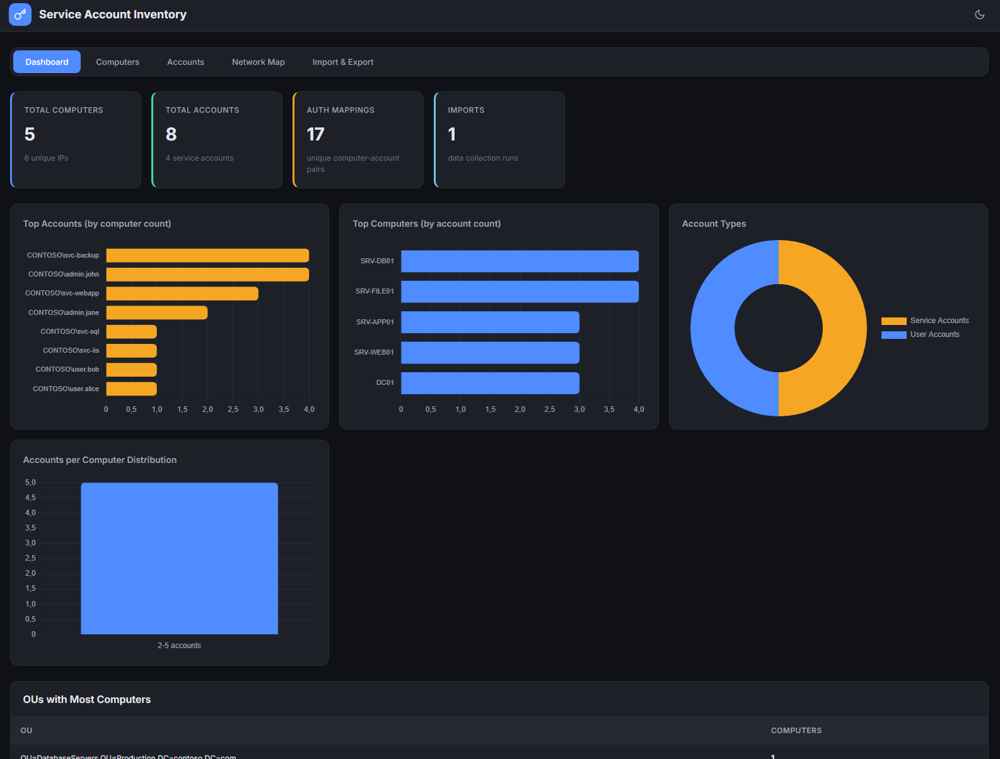
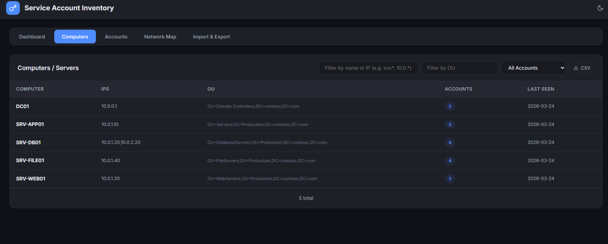
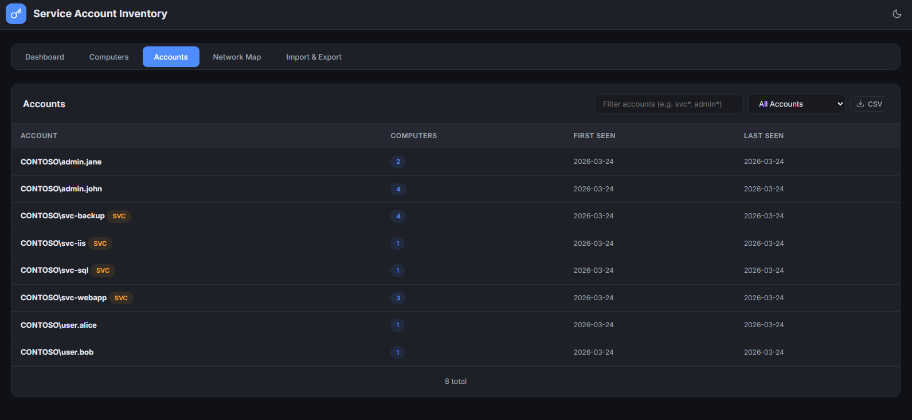
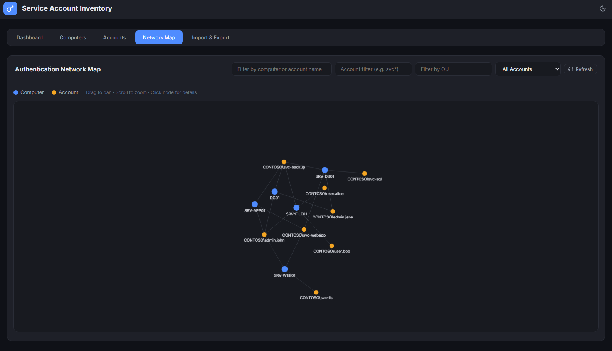
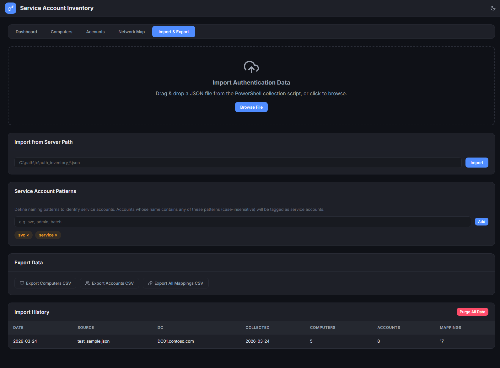

# Auth Mapper

Visualize which accounts authenticate against which servers by collecting data from Domain Controller security logs. Designed to run locally on a Windows machine in your on-prem environment.

## Screenshots

**Dashboard** — Overview with KPI cards, authentication activity chart, and top accounts/computers.


**Computers** — All discovered servers with IPs, OUs, and authenticated account counts.


**Accounts** — Every account seen in logon events, with the number of computers it authenticated to.


**Network Map** — Interactive force-directed graph showing which accounts connect to which servers.


**Data & Settings** — Import, export, backup/restore, tier levels, and service account pattern configuration.


## Features

- **PowerShell collection script** — Queries DC security logs (Event 4624, 4768, 4769, 4776) for logon, Kerberos TGT/service ticket, and NTLM events; resolves computer OUs from AD, outputs JSON
- **Jumphost parser** — Export .evtx from DC, parse locally on any domain-joined machine (minimal DC load for large environments)
- **Auth protocol detection** — Identifies actual authentication protocol (Kerberos or NTLM) per account via `LmPackageName`, displayed as color-coded badges in the UI
- **gMSA support** — Group Managed Service Accounts are detected via AD query, cached locally, and tracked alongside regular accounts (not filtered out like machine accounts)
- **UPN resolution** — One-time AD export of UPN→sAMAccountName mappings cached to `upn_cache.json`; auto-refreshes after 24h (configurable via `-UpnCacheHours`)
- **Tier tagging** — Configurable tier levels (default T0/T1/T2) for classifying computers and accounts; Domain Controllers are auto-tagged T0 on import; manual tagging via detail modals; filterable on all views
- **Owner tagging** — Assign ownership to computers and accounts from a configurable list of teams/owners; filterable on Computers, Accounts, and Network Map tabs
- **Web dashboard** — Dark/light themed UI with 8 KPI cards (computers, accounts, mappings, imports, tier coverage, owner assignment, auth protocols), growth badges showing changes since last import, and 4 charts (top accounts, top computers, account types, distribution)
- **Computers tab** — List all computers/servers with IPs, OUs, tier badges, owner badges, and account counts; sortable, filterable by search, OU, tier, and owner
- **Accounts tab** — All unique accounts with computer counts, auth type badges (Kerberos/NTLM), tier and owner badges; filter by pattern, OU, tier, or owner
- **Network map** — Interactive canvas-based graph showing account → computer authentication relationships; filter by search, OU, tier, owner, or service accounts only
- **OU autocomplete** — Custom Chrome-style dropdown on all OU filters with top-5 matching results, bold keyword highlighting, keyboard navigation, and full-path tooltip on hover
- **Service account detection** — Configurable naming patterns (e.g. `svc`, `service`, `gmsa`) with "Service Accounts Only" filter on all views
- **Coverage gap analysis** — Import AD computer/account snapshots to compare against observed auth data; identify machines and accounts in AD that have no authentication activity
- **Import system** — Drag & drop JSON files, import from server path, supports multiple import runs with data merging; import history with per-run counts
- **CSV export** — Export computers, accounts, or full mappings to CSV; supports filtered exports
- **Backup & restore** — Download a full JSON backup of all data (computers, accounts, mappings, IPs, tiers, owners, import history) and settings; restore from backup replaces all data

## Quick Start

### 1. Collect Data

**Option A — Run directly on DC:**

```powershell
.\scripts\Collect-AuthInventory.ps1 -HoursBack 168
```

| Parameter | Default | Description |
|-----------|---------|-------------|
| `-HoursBack` | 24 | How far back to search in the security log |
| `-MaxEvents` | 0 (all) | Limit the number of events to process |
| `-DomainController` | localhost | Target DC hostname |
| `-OutputPath` | script dir | Where to write the JSON output |
| `-UpnCacheHours` | 24 | Hours before UPN/gMSA caches are refreshed |
| `-RefreshUpnCache` | — | Force rebuild of UPN and gMSA caches |

**Option B — Export + parse on jumphost (recommended for large environments):**

```powershell
# On DC: export filtered events (takes seconds)
wevtutil epl Security \\jumphost\c$\temp\dc01_security.evtx /q:"*[System[(EventID=4624 or EventID=4768 or EventID=4769 or EventID=4776)]]"

# On jumphost: parse locally
.\scripts\Parse-AuthEvtx.ps1 -EvtxPath C:\temp\dc01_security.evtx -DomainController DC01
```

**Option C — Automatic export + parse from jumphost:**

```powershell
.\scripts\Parse-AuthEvtx.ps1 -ExportFromDC DC01.contoso.com -HoursBack 72
```

| Parameter | Default | Description |
|-----------|---------|-------------|
| `-EvtxPath` | — | Path to an exported .evtx file (Option B) |
| `-ExportFromDC` | — | DC FQDN to auto-export from (Option C) |
| `-DomainController` | — | DC name used for OU lookups and computer resolution |
| `-HoursBack` | 0 (all) | Filter events to the last N hours |
| `-OutputPath` | script dir | Where to write the JSON output |
| `-UpnCacheHours` | 24 | Hours before UPN/gMSA caches are refreshed |
| `-RefreshUpnCache` | — | Force rebuild of UPN and gMSA caches |

Output: `auth_inventory_YYYYMMDD_HHmmss.json`

**AD Coverage Snapshot (optional):**

Collect all computer and account objects from AD to identify coverage gaps — machines and accounts that exist in AD but have never appeared in security event logs.

```powershell
.\scripts\Collect-ADCoverage.ps1
.\scripts\Collect-ADCoverage.ps1 -SearchBase "OU=Servers,DC=contoso,DC=com"
.\scripts\Collect-ADCoverage.ps1 -IncludeDisabled -Server DC01.contoso.com
```

| Parameter | Default | Description |
|-----------|---------|-------------|
| `-OutputPath` | script dir | Where to write the JSON output |
| `-IncludeDisabled` | — | Include disabled computer and account objects |
| `-ComputersOnly` | — | Only collect computer objects (skip accounts) |
| `-AccountsOnly` | — | Only collect account objects (skip computers) |
| `-SearchBase` | — | AD distinguished name to limit scope (e.g. `OU=Servers,DC=contoso,DC=com`) |
| `-Server` | auto-detect | Target Domain Controller to query |

Output: `ad_coverage_YYYYMMDD_HHmmss.json` — import into the web app alongside auth data to see the **Coverage** gap analysis.

### 2. Set Up the Web App (Windows)

**Prerequisites:**
- [Node.js](https://nodejs.org/) (v18 or later) — download the Windows installer from nodejs.org
- Git (optional, for cloning the repo)

**Install and run:**

```powershell
# Clone the repo (or download and extract the ZIP)
git clone https://github.com/lundstream/Auth-mapper.git
cd Auth-mapper

# Install dependencies
npm install

# Start the server
npm start
```

Open http://localhost:3002 in your browser.

The app runs entirely on your local machine — no internet connection required after setup.

### 3. Import Data

- Go to **Data & Settings** tab
- Drag & drop the JSON file, or enter the file path and click Import
- Import multiple files — data is merged (unique computers/accounts/mappings)

## Settings

Copy `settings.example.json` to `settings.json` and adjust:

```json
{
  "port": 3002,
  "svcPatterns": ["svc", "service", "gmsa"],
  "tierLevels": ["T0", "T1", "T2"],
  "owners": ["Team A", "Team B"]
}
```

- `svcPatterns` — substrings used to identify service accounts (case-insensitive)
- `tierLevels` — tier classification levels for computers and accounts (DCs are auto-tagged T0)
- `owners` — list of team/owner names available for assignment to computers and accounts

Both are configurable from the web UI under **Data & Settings**.

## Tech Stack

- Node.js + Express 5
- SQLite (better-sqlite3)
- Chart.js 4
- Feather Icons
- Vanilla JS frontend (same look & feel as [Vire](https://github.com/lundstream/Vire))
